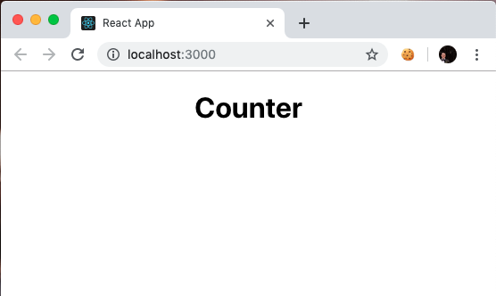
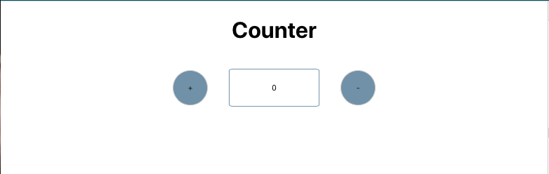
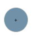

## React Workshop
This workshop is designed to take someone through the basics of react. during this workshop you will. Learn the basics of react (components, testing, hooks, etc.) and apply them with a real world coding challenge.

### Creating a basic react app. 
In this workshop we are going to use 'create react app' which is a ready made project that installs react and all it's dependencies. 

To use create react app you will need node. which you can get [here](https://nodejs.org/en/).

to create a new react app type: 

``` npx create-react-app counter ```

```counter``` is the name of the app we will make this workshop.

Have a look around the repo (I'll explain in the session what each file is for)

read [this](https://github.com/facebook/create-react-app) doc to find out more.

to start your app run

```
 npm install
 npm run start
 ```

 ### Challenge 1
 Goal: write a test that hello world is displayed and pass it

 go to ```src/App.test.js```
  - Run the tests using ``` npm run test ```
  - can you modify this to check if the app displays the phrase 'Hello, World!'

 ### Making it your own
 Now that we understand that in ```index.js``` we are rendering the component in `app.js` lets creare our own app.js. 

 I Want you to delete *everything* in the following files. 

    - src/App.js
    - src/App.css

to create a react component you sould start by defining a function. 

```
function App() { 

}
```

Javascript (ES6) is a modular language. you have to specify what parts of a fle can be seen by any file that imports it. 

add the following line to the bottom of your file.
```
export default App
```
In react a component returns what you want to display on the screen. lets use teh React.createElement function to create a div like so.  
```
return React.createElement(
      "div",
      null,
      "Hello ",
      this.props.name
    );
```

You'll need to import react. 
```
import React from 'react'
```

Now run your tests and see if they pass.

Congradulations, you've passed the challenge.

### JSX
calling that React.createElement was a bit exausting huh! Thankfully we have JSX. JSX is a superscript of react that looks like HTML and is intuitive to any html user. 

try swapping opt the React.createElement line with
``` 
    <div>Hello, World!</div>
```
Much nicer. 

### Styling and css

In react we can import css like it was a js file. In ```App.js``` add the import in.

```
import './App.css'
```

lets add a class to our div. as ```class``` is a reserved word in JavaScript JSX uses className. 

```
    <div className="page-heading">Hello, World!</div>
```

And some css

```
.page-heading { 
  width: 100%;
  text-align: center;
}
```

Finally as this is a header lets use the html header tag instead of ```</div>```

```
    <h1 className="page-heading">Counter</h1>
```

Change the text from hello world to counter and you should see this. 



### Challenge 2: Lay out a counter app
You now know how to: 
- Create a React component
- Style it
- Use JSX. 

So you know everything that you need to know to create the following layout. Don't implement anything yet. Just lay out the components.



For sakes of argument use the following styles. 

```
.counter-container-button { 
  height: 50px;
  width: 50px;
  margin: 15px;
  border-radius: 100%;
  background-color: #7f9cb3;
}

.counter-container-input {
  margin: 15px;
  text-align: center;
  display: inline;
}
```


### Creating seperate components

Time for a refactror  - and a chance to learn about nested components. A component is one reuasable piece of the UI. An obvious place to start with this would be with the counter buttons.

create some new Files. 

```
src
  - CounterButton
    - CounterButton.js
    - CounterButton.css
    - CounterButton.test.js
```

Notice here I've also included the Button.test.js file. Now we've got used to react we ccan start improving our testing knowledge.

Let's check that we can render the '+' button. 

```
import React from 'react';
import { render } from '@testing-library/react';
import CounterButton from './CounterButton';

test('renders a + button', () => {
  const { getByText } = render(<CounterButton />);
  const linkElement = getByText(/\+/i);
  expect(linkElement).toBeInTheDocument();
});
```

Challenge, write the code for this button<br/>


Let's start off with a test in CounterButton.test.js

```
import React from 'react';
import { render } from '@testing-library/react';
import CounterButton from './CounterButton';

test('renders a button', () => {
  const { getByText } = render(<CounterButton />);
  const plusButton = getByText(/\+/i);
  expect(plusButton).toBeInTheDocument();
});
```
Let's start off with a test in App.test.js

```
import React from 'react';
import { render } from '@testing-library/react';
import App from './App'

test('renders a button', () => {
  const { getByText } = render(<App />);
  const plusButton = getByText(/\+/i);
  expect(plusButton).toBeInTheDocument();
});
```

Your go. implenment this button in react and add it to yout site.

### Props

The point of react is that we can reuse components. As the '+' and '-' buttons are the same but with different text, let's see if we can reuse the ```<CounterButton />``` component. 

React components (as we discussed before) are functions. And we can pass arguments to functions. react passes an object called ```props``` into each reach component.

we can specify what goes in to our props object by adding them as attributes to the JSX component. Like So. 
```
  <CounterButton text="+" />
```

let's change our CounterButton.test.js to have two tests one for + and one for - specified as props. 

```
import React from 'react';
import { render } from '@testing-library/react';
import CounterButton from './CounterButton';

test('renders a + button', () => {
  const { getByText } = render(<CounterButton text="+"/>);
  const plusButton = getByText(/\+/i);
  expect(plusButton).toBeInTheDocument();
})

test('renders a - button', () => {
  const { getByText } = render(<CounterButton text="-"/>);
  const minusButton = getByText(/-/i);
  expect(minusButton).toBeInTheDocument();
});
```

And our app.test.js
```
import React from 'react';
import { render } from '@testing-library/react';
import App from './App'

test('renders a + button', () => {
  const { getByText } = render(<App />);
  const plusButton = getByText(/\+/i);
  expect(plusButton).toBeInTheDocument();
})

test('renders a - button', () => {
  const { getByText } = render(<App />);
  const minusButton = getByText(/-/i);
  expect(minusButton).toBeInTheDocument();
});
```


Now let's pass these props into our CounterButton in ```CounterButton.js```

```
function CounterButton(props) { 
```

JavaScript is a dynamically typed language. So there is no type checking. React encorages us to type check our props. We can use PropTypes to do this.

```
CounterButton.propTypes = { 
  text: PropTypes.string
}
```

Finally let's use it.

```
   <button className="counter-container-button">{props.text}</button>
```

### State management with hooks

Now we have our + and - buttons we can begin to talk about state. we need state to increase or decrease the value of the counter. 

React has a concept of hooks, thease are functions baked into React that can respond to stateful and lifecycle events.

Before we begin let's add a test to App.test.js that the counter has a default vlue of 0. 


```
test('counter defaults to 0', () => {
    const { getByTestId } = render(<App />); 
    const element = getByTestId('counter')
    expect(getNodeText(element)).toContain(0)
})
```

Now we need our test to simulate a button being pressed. we can do this like this.


